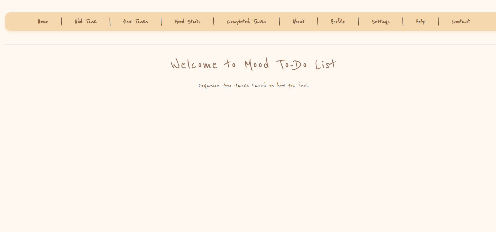
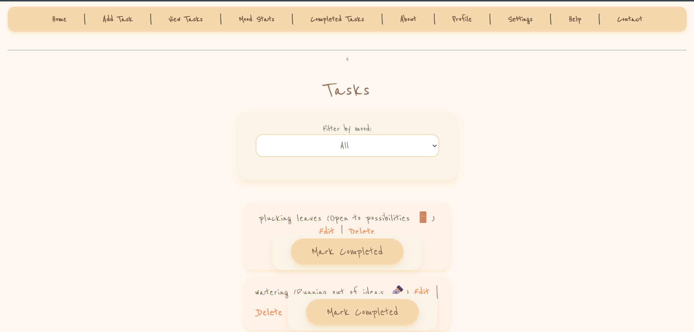

# Mood To Do List 

## Basic Details
### Team Name: Glitch

### Team Members
- Team Lead: Krishna Krishnakumar - Muthoot Institute of Technology and Science
- Member 2: Nandana Rajeev - Muthoot Institute of Technology and Science

### Project Descriptions 
Mood-Driven Task Manager: A fun to-do list app that not only tracks your tasks but predicts moods—even for non-living things!

### The Problem (that doesn't exist)
Most task managers are boring and lack personality. They only track tasks but don’t add any fun or humor. Our project “solves” this nonexistent problem by predicting moods for tasks—even non-living things—making everyday task management a bit more entertaining and surprising!

### The Solution (that nobody asked for)
We added mood predictions not just for your tasks, but also for your non-living stuff—because why should only people have feelings? Whether it’s your coffee mug feeling empty or your laptop overheating, our app makes task management weirdly fun and totally unnecessary—in the best way possible!

## Technical Details
### Technologies/Components Used
For Software:
- Languages used:Python, HTML, CSS, JavaScript
- Frameworks used:Flask (Python web framework)
- Libraries used:Collections (Counter), Random (for mood variations)
- Tools used :VS Code (or any code editor), Git, Flask development server
### Implementation
For Software:
# Installation
pip install Flask

# Run
python app.py

### Project Documentation
For Software:

# Screenshots (Add at least 3)

Homepage of the Mood To Do List Application showing the main navigation menu and welcome message

.png)
Add new task page of the Mood To List Application where users can enter a task name,select a Mood,and optionally enable Mood prediction for Non living things before adding the tasks

View Task page of the Mood To Do List Application showing all added tasks with options to filter by Mood,Edit,Delete or mark them as completed.

# Diagrams

*Add caption explaining your workflow*

### Project Demo
# Video

<video width="630" height="300" src="./video.mp4" controls></video>
*Explain what the video demonstrates*

## Team Contributions
- Krishna Krishnakumar: Design and developed the Mood To Do List,the user interface including navigation ,task management pages,and overall layout styling
- Nandana Rajeev:Implemented the Backend functionality for adding,viewing,editing and deleting tasks along with Mood filtering and prediction features.
- 
---
Made with ❤️ at TinkerHub Useless Projects 

